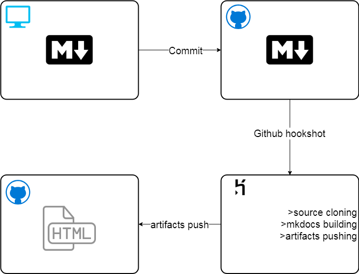

<!--## Heroku app

1. retrieving sources
```
git clone https://github.com/soo-underground/docpage-source.git
```
2. building mkdocs project
```
cd docpage-source/my-project
ls
mkdocs build
cd site
ls
```
3. pushing changes
```
cd docpage-source/my-project/site
ls
git init
echo "git initiated"
git add .
echo "repo added" #delay
git config user.email "bordovskiy92@gmail.com"
git config user.name "soo-underground"
git commit -m "commit from heroku autobuild"
echo "config set"
echo $1
git remote add build https://soo-underground:$1@github.com/soo-underground/soo-underground.github.io.git
echo "password accepted, remote added"
git remote -v
git push --force origin master
echo "artifacts pushed"
```


<details>
<summary>scheme</summary>
<br>

</details>
-->
