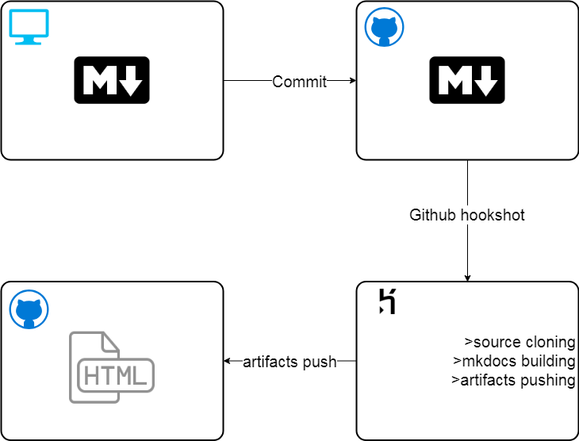

# Continuous Integration
Continuous integration is powered by a [heroku app](https://github.com/soo-underground/heroku-mkdocs-buildapp).

This app provides remote builds and commits into Github Pages repo.
The whole workflow for any changes on this pages works like this:

1. Technical writer edits source file at his local copy of the projects. At this step website can be built locally with the MkDocs command `mkdocs build` and viewed in browser at `127.0.0.1:8000`.
2. Technical writer commits and pushes his local changes to the [source repo](https://github.com/soo-underground/docpage-source).
3. Github automatically sends POST-request at the predetermined URL of a heroku build build app.
4. Heroku app receives this requests and starts the process of mkdocs building:
    1. BuildApp clones docpage-source repo, install MkDocs and all of it's required dependencies (such as Material, Fenced code tabs, e.t.c).
    2. BuildApp starts `mkdocs build` to create html-output from markdown source files.
    3. BuildApp pushes all of MkDocs output into [Github Pages Repo](https://github.com/soo-underground/soo-underground.github.io).
5. After a while (from 30 seconds to several minutes) all the changes can be viewed at https://soo-underground.github.io.

Here's a rough scheme of the whole process:


<!--## Heroku app

1. retrieving sources
```
git clone https://github.com/soo-underground/docpage-source.git
```
2. building mkdocs project
```
cd docpage-source/my-project
ls
mkdocs build
cd site
ls
```
3. pushing changes
```
cd docpage-source/my-project/site
ls
git init
echo "git initiated"
git add .
echo "repo added" #delay
git config user.email "bordovskiy92@gmail.com"
git config user.name "soo-underground"
git commit -m "commit from heroku autobuild"
echo "config set"
echo $1
git remote add build https://soo-underground:$1@github.com/soo-underground/soo-underground.github.io.git
echo "password accepted, remote added"
git remote -v
git push --force origin master
echo "artifacts pushed"
```


<!-- <details>
<summary>scheme</summary>
<br>

</details>
-->
